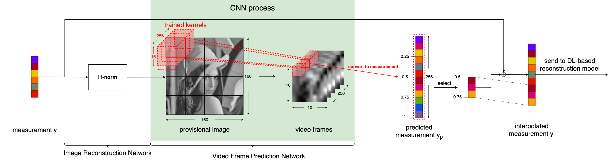

# CSMCNet-with-Interpolation-Module

## Introduction
We apply our Interpolation Module (IM) to [CSMCNet](https://arxiv.org/abs/2108.01522) [1].

## Method

IM allows for scalable reconstruction and reconfigurations to existing deep-learning methods while maintaining the reconstruction quality.

## References
[1] Bowen Huang, Jinjia Zhou, Xiao Yan, Ming'e Jing, Rentao Wan, and Yibo Fan, "Cs-mcnet: A video compressive sensing reconstruction network with interpretable motion compensation," in Computer Vision - ACCV 2020, Hiroshi Ishikawa, Cheng-Lin Liu, Tomas Pajdla, and Jianbo Shi, Eds., Cham, 2021, pp. 54-67, Springer International Publishing.